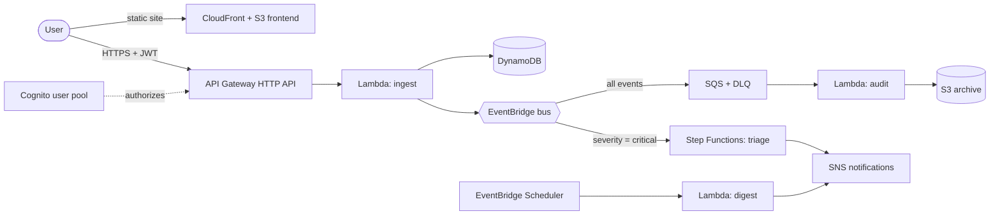

# serverless-incident-hub

An event-driven, serverless incident intake and triage platform on AWS, built to demonstrate
architectural decision-making across as many managed AWS services as the host account allows, with a
**teardown-first** approach: nothing is created before I know how to remove it.

This is the second project of my cloud portfolio. The first,
[`modular-cicd-pipeline`](https://github.com/velasqueziturrate/modular-cicd-pipeline), covers containers,
Kubernetes, CI and Terraform. This one covers the serverless / event-driven paradigm, deliberately with a
different IaC tool (CloudFormation) and the same habit: every choice is documented with its trade-off.

> **Status:** Phase 0 (guardrails). Nothing beyond the teardown tooling exists yet. The architecture below is the plan, not the result.

## Why this project exists

Most portfolio projects replicate a tutorial. The goal here is to show *why* each service and tool was
chosen, under real constraints: an account I do not own, unknown service restrictions, and a strict
cost rule (create, verify, destroy). The use case (incident intake and triage) comes from my
day-to-day work in production support, so the event flows are realistic rather than invented.

## Planned architecture



Cross-cutting: CloudWatch (logs, metrics, alarms, dashboard), X-Ray, IAM least privilege, SSM Parameter Store,
CloudFormation, AWS Budgets, GitHub Actions with OIDC. Optional, if the account allows it: Translate / Comprehend / Bedrock.

## Architecture philosophy

Each decision is documented with its alternatives. "Implemented" means it exists in this repo and was run;
"Documented" means analysed on paper only.

| Decision | Options | Status |
| --- | --- | --- |
| IaC | CloudFormation vs Terraform vs SAM vs CDK ([ADR 001](docs/decisions/001-cloudformation-over-terraform.md)) | CloudFormation proposed; Terraform used in project 1; SAM and CDK documented only |
| Stack layout and teardown | Layered stacks `sih-NN-name` ([ADR 002](docs/decisions/002-stack-layering-and-teardown-order.md)) | Proposed |
| Service availability | Discovered by probing, not assumed ([PREFLIGHT](docs/PREFLIGHT.md), generated in Phase 0) | Pending |

More ADRs and comparisons are added as phases are completed.

## About the AWS account

This project is built against an AWS account that belongs to someone else, so it may not be
reproducible without equivalent access. Organization policies (SCPs) or missing IAM permissions can block
services; `scripts/preflight.sh` finds out which before anything is designed around them. No account IDs
or credentials are committed. Anyone adapting the project should set their own values in `scripts/config.sh`.

## Teardown (read this first)

Every resource is created by CloudFormation stacks named `sih-<NN>-<name>` and tagged
`Project=serverless-incident-hub`, so everything can be removed with:

```bash
./scripts/teardown.sh list      # what would be deleted (read-only)
./scripts/teardown.sh destroy   # delete everything (asks you to type the account ID)
./scripts/teardown.sh verify    # look for leftovers
```

Full runbook, including the console procedure (English/Spanish names), idle-cost table and common
failures: [`docs/TEARDOWN.md`](docs/TEARDOWN.md).

## What is automated vs manual (design intent)

| Step | Automated? |
| --- | --- |
| Template validation / lint on push (`cfn-lint`) | Planned (GitHub Actions, no AWS credentials needed) |
| Deploying stacks | Manual and deliberate, by design (cost control) |
| Teardown | Manual and deliberate: `scripts/teardown.sh` with account-ID confirmation |

Nothing touches real AWS infrastructure without a human running a command on purpose.

## Roadmap

Each phase starts only if the preflight shows the account allows its services, and ends with the
documentation updated and the stacks either destroyed or explicitly kept.

- [ ] **Phase 0 - Guardrails:** repo, teardown script and runbook, service preflight, ADR 001-002
- [ ] Phase 1 - Foundation: bootstrap stack (artifacts bucket), tagging, budget alert if permitted
- [ ] Phase 2 - Data layer: DynamoDB, S3
- [ ] Phase 3 - Ingest API: API Gateway HTTP API, Cognito, Lambda
- [ ] Phase 4 - Event backbone: EventBridge, SQS + DLQ, SNS
- [ ] Phase 5 - Orchestration: Step Functions triage workflow, EventBridge Scheduler
- [ ] Phase 6 - Observability: CloudWatch dashboard and alarms, X-Ray, structured logs
- [ ] Phase 7 - Frontend: S3 + CloudFront
- [ ] Phase 8 - CI: GitHub Actions with OIDC, `cfn-lint`
- [ ] Phase 9 - Optional AI services (Translate, Comprehend, Bedrock) if the account allows

## Repository structure

```
cfn/          CloudFormation templates, one folder or file per layer (sih-NN-name)
lambda/       Lambda function source code
scripts/      config.sh, teardown.sh, preflight.sh
docs/         SETUP.md (build log), TEARDOWN.md (runbook), PREFLIGHT.md (generated),
              decisions/ (ADRs), comparisons/
```

## Cost control

All resources are tagged and provisioned only through CloudFormation, so they can be reliably removed.
Services with a flat charge while idle are avoided or documented (see the table in
[`docs/TEARDOWN.md`](docs/TEARDOWN.md)), and event loops are guarded against by design (concurrency caps,
throttling, dead-letter queues).

## Author

Daniel Velásquez Iturrate - DevOps Engineer transitioning to Cloud Engineering.
[Portfolio](https://iturrate-cloud-solutions-architect.webflow.io) - [GitHub](https://github.com/velasqueziturrate)
